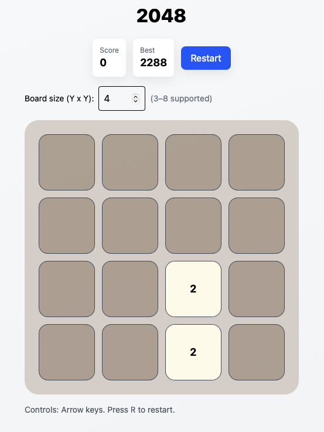

# 2048 - React

1. `npm create vite@latest my-2048 --template react`
2. Copy the `src/` files from this project into `my-2048/src`.
3. (Optional) Install Tailwind if you want exact same styling.
4. `npm install`
5. `npm run dev`

Notes:
- Files are modular: game logic lives in `src/utils/board.js` 
- `GameBoard.jsx` focuses on UI and user interactions only.